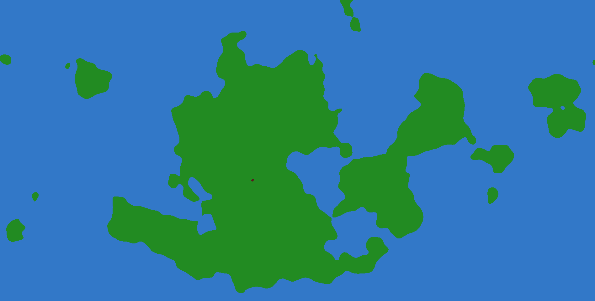
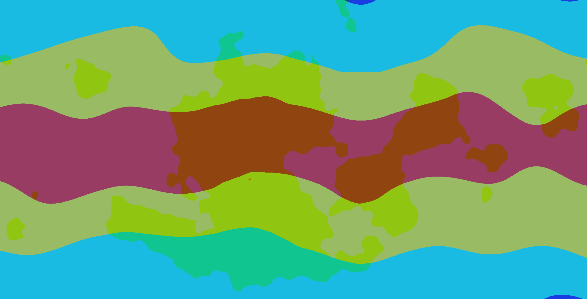

# WORLDGEN

A procedural 2D map generator in **Rust**.

This project is mainly a way for me to **learn Rust** by building something fun — generating **procedural 2D maps** using **noise functions**.

---

## Preview

**Height map**  
Defines the seas, continents and islands.

**Temperature map**  
Shows climate across the map based on latitude and noise.
